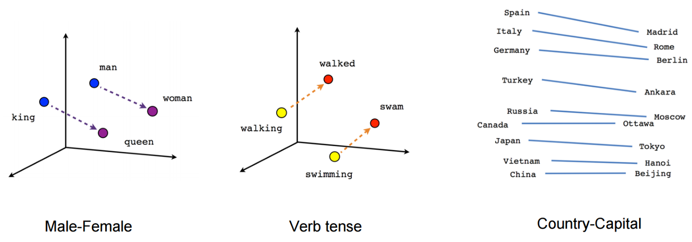

# **word2vec** model implementation in python

word2vec is a family of algorithms introduced about a decade ago by [Mikolov et al.](https://arxiv.org/abs/1301.3781) at Google, and describes a way of learning word embeddings  from large datasets in an unsupervised way. These have been tremendously popular recently and has paved a path for machines to understand contexts in natural language. These embeddings are essentially a lower-dimensional vector representation of each word in a given vocabulary within certain context and helps us capture its semantic and syntactic meaning. Taking it one step further, these vector representations can also formulate relationships with other words, e.g. **woman + king - man = queen**. Isn't this amazing?



Word Vectors (or Word Embeddings) have founds its way as the basis of several applications such as question answering, text generation, translation, sentiment analysis, recommendation engines etc., and is considered to be one of the major building blocks for any language modeling task.

This repo provides a complete word2vec pipeline without using any ML framework for a better understanding of all underlying mechanics. For more details, please refer to my blog post: [What is 'word2vec' and how to build it from scratch?](https://www.towardsautonomy.com/practical-ai) 

 -  [Part 1 - Intuition and Theory](https://www.towardsautonomy.com/practical-ai/word2vec-part1)
 -  [Part 2 - Skip-Gram Implementation](https://www.towardsautonomy.com/practical-ai/word2vec-part2)

This repo implements the training pipeline for skip-gram variant of **word2vec** with both *naive-softmax* and *negative-sampling* based objective functions. Figure below visualizes the word vectors for a few words on a 2-dimensional plane through rank-2 approximation computed using SVD. 


## Get Started

 - Set up the environment: ```conda env create -f conda_env.yml```  
 - Download the dataset: ```sh get_dataset.sh```  
 - Run the training pipeline: ```python train.py```  